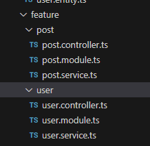
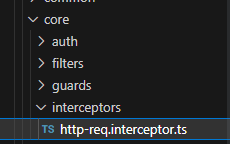

# nestjs超详细从零到零点五详细入门项目搭建过程

从零到有搭建一个完整的后台管理系统项目

涉及到的知识

- controller控制器provider提供者module模块middleware中间件filter过滤器pipe管道guard守卫interceptor拦截器@装饰器
- 生命周期事件onModuleInit
- TypeORM
- 热重载
- Swagger

[nestjs中文文档](https://docs.nestjs.cn/9)

[nestjs官方英文文档](https://docs.nestjs.com/first-steps)

## 新建项目

梦开始的地方初始化项目

```
npm i -g @nestjs/cli
nest new project-name
// 这里我使用pnpm作为包管理工具
cd project-name
```

打开.eslintrc.js注释其中两行，额，看个人喜好，我很难受这个东西，这个是用来校验语法的

```
module.exports = {
  parser: '@typescript-eslint/parser',
  parserOptions: {
    project: 'tsconfig.json',
    tsconfigRootDir: __dirname,
    sourceType: 'module',
  },
  plugins: ['@typescript-eslint/eslint-plugin'],
  extends: [
    // 'plugin:@typescript-eslint/recommended',
    // 'plugin:prettier/recommended',
  ],
  root: true,
  env: {
    node: true,
    jest: true,
  },
  ignorePatterns: ['.eslintrc.js'],
  rules: {
    '@typescript-eslint/interface-name-prefix': 'off',
    '@typescript-eslint/explicit-function-return-type': 'off',
    '@typescript-eslint/explicit-module-boundary-types': 'off',
    '@typescript-eslint/no-explicit-any': 'off',
  },
};

```

安装express

```
pnpm add express
```


## 配置项目热重载

对应用程序的引导过程影响最大的是 `TypeScript` 编译。但问题是，每次发生变化时，我们是否必须重新编译整个项目？一点也不。这就是为什么 [webpack](https://github.com/webpack/webpack) `HMR`（Hot-Module Replacement）大大减少了实例化您的应用程序所需的时间。

安装依赖

```
pnpm add webpack-node-externals run-script-webpack-plugin webpack
```

新建文件webpack-hmr.config.js

放在根目录填入一下内容

```
// webpack-hmr.config.js

const nodeExternals = require('webpack-node-externals');
const { RunScriptWebpackPlugin } = require('run-script-webpack-plugin');

module.exports = function (options, webpack) {
  return {
    ...options,
    entry: ['webpack/hot/poll?100', options.entry],
    externals: [
      nodeExternals({
        allowlist: ['webpack/hot/poll?100'],
      }),
    ],
    plugins: [
      ...options.plugins,
      new webpack.HotModuleReplacementPlugin(),
      new webpack.WatchIgnorePlugin({
        paths: [/\.js$/, /\.d\.ts$/],
      }),
      new RunScriptWebpackPlugin({ name: options.output.filename }),
    ],
  };
};

```

为了启用 `HMR`，请打开应用程序入口文件（ `main.ts` ）并添加一些与 `Webpack`相关的说明，如下所示：

```typescript
declare const module: any;

async function bootstrap() {
  const app = await NestFactory.create(AppModule);
  await app.listen(3000);

  if (module.hot) {
    module.hot.accept();
    module.hot.dispose(() => app.close());
  }
}
bootstrap();
```

就这样。为了简化执行过程，请将这两行添加到 `package.json` 文件的脚本中。

```json
"start:dev": "nest build --webpack --webpackPath webpack-hmr.config.js --watch"
```

现在只需打开你的命令行并运行下面的命令：

```bash
pnpm start:dev
```

你的项目可以快速刷新了哈哈哈

## 配置Swagger文档

[OpenAPI](https://swagger.io/specification/)(Swagger)规范是一种用于描述 `RESTful API` 的强大定义格式。 `Nest` 提供了一个专用[模块](https://github.com/nestjs/swagger)来使用它。

首先安装他

```bash
pnpn add --save @nestjs/swagger swagger-ui-express
```

初始化 main.ts

```
// main.ts
import { NestFactory } from '@nestjs/core';
import { AppModule } from './app.module';
import { NestExpressApplication } from '@nestjs/platform-express';
import { DocumentBuilder, SwaggerModule } from '@nestjs/swagger';

declare const module:any;


async function bootstrap() {
  // 使用express作为默认配置
  const app = await NestFactory.create<NestExpressApplication>(AppModule);
  

  // swagger配置
  const options = new DocumentBuilder()
    .setTitle("red润的入门小项目")
    .setDescription("一个初级练习项目")
    .setVersion("1.0")
    .build();
  
  const documents = SwaggerModule.createDocument(app,options);
  SwaggerModule.setup("api",app,documents);


  await app.listen(3000);

  // 热重载
  if (module.hot) {
    module.hot.accept();
    module.hot.dispose(() => app.close());
  }

}
bootstrap();

```

```
// app.controller.ts
import { Controller, Get } from '@nestjs/common';
import { AppService } from './app.service';
import { ApiTags } from '@nestjs/swagger';


@ApiTags("就好看")
@Controller()
export class AppController {
  constructor(private readonly appService: AppService) {}

  @Get()
  getHello(): string {
    return this.appService.getHello();
  }
}

```

保存运行项目pnpm start:dev

然后输入地址localhost:3000/api可以看到文档效果效果了


## 新建一些文件目录

搭建项目目录结构


- common存放一个公共的装饰器，接口，工具类等
- core存放 守卫，过滤器，拦截器，校验器等
- dto存放dto文件定义一些请求或者返回数据结构
- entities存放typeorm要使用的文件，对应着数据库里面的表
- feature 业务主要功能都写在这里面

## [TypeORM 集成](https://docs.nestjs.cn/9/techniques?id=typeorm-集成)

[TypeORM - 一个 ORM 框架 | TypeORM 中文文档 | TypeORM 中文网 (bootcss.com)](https://typeorm.bootcss.com/)

为了与 `SQL`和 `NoSQL` 数据库集成，`Nest` 提供了 `@nestjs/typeorm` 包。`Nest` 使用[TypeORM](https://github.com/typeorm/typeorm)是因为它是 `TypeScript` 中最成熟的对象关系映射器( `ORM` )。因为它是用 `TypeScript` 编写的，所以可以很好地与 `Nest` 框架集成。

安装依赖文件

```
pnpm add --save @nestjs/typeorm typeorm mysql2
```

将TypeOrmModule导入AppModule

```
// app.module.ts
import { Module } from '@nestjs/common';
import { TypeOrmModule } from '@nestjs/typeorm';

@Module({
  imports: [
    TypeOrmModule.forRoot({
      type: 'mysql',// 连接mysql数据库
      host: 'localhost',
      port: 3306,
      username: '用户名',
      password: '数据密码',
      database: '数据库名',
      // 自动加载实体
      autoLoadEntities:true,
      // 手动导入
      // entities: [],
      synchronize: true,
    }),
  ],
})
export class AppModule {}

```

在entities目录下面新建两个文件

```
// entities/post.entity.ts
import { Column, Entity, ManyToMany, ManyToOne, PrimaryColumn, PrimaryGeneratedColumn } from "typeorm";
import { User } from "./user.entity";

@Entity("post")
export class Post{
    @PrimaryGeneratedColumn()
    id:number;

    @Column()
    title:string;

    @Column()
    content:string;

    // 在 @ManyToOne 一侧，即在外键拥有者一侧，设置 onDelete，就可以使用外键的级联功能，这里设置级联删除，当删除 user 时，user 的所有 post 会被级联删除
    @ManyToOne(type => User, user => user.posts, {
        cascade: true,// 自动保存相关对象
        onDelete: 'CASCADE'
    })
    user:User;
}
```

```
// entities/user.entity.ts

import { Column, Entity, OneToMany, PrimaryGeneratedColumn } from "typeorm";
import { Post } from "./post.entity";

@Entity("user")
export class User{
    // 自增唯一主键
    @PrimaryGeneratedColumn()
    id:number;

    // 账户名类型
    @Column()
    account:string;

    // 密码
    @Column()
    password:string;

    // 用户名
    @Column()
    name:string;

    // 用户管理文章 多个文章对应一个用户
    @OneToMany(type=>Post,post=>post.user)
    posts:Post[];

    @Column()
    roel:string;
}
```

## 新建post和user模块

post是文章模块，user是用户信息模块

执行命令

```
nest g res feature/user --no-spec && nest g res feature/post --no-spec
```

记得选rest api然后选择No，然后就这样了



此模块使用 `forFeature()` 方法定义在当前范围中注册哪些存储库。这样，我们就可以使用 `@InjectRepository()`装饰器将 `UsersRepository` 注入到 `UsersService` 中:

所有将user和post的module文件都注册上对应的entity文件


## 全局过滤器拦截错误

将报错的格式，自己拦截下来，返回自己想要的样式

新建文件


```
// all-exception.filter.ts

import { ExceptionFilter, Catch, ArgumentsHost, HttpException, HttpStatus } from '@nestjs/common';
import { Request, Response } from 'express';

@Catch(HttpException)
export class AllExceptionFilter implements ExceptionFilter {
  catch(exception: HttpException, host: ArgumentsHost) {
    const ctx = host.switchToHttp();
    const request = ctx.getRequest<Request>();
    const response = ctx.getResponse<Response>();
    const status = exception instanceof HttpException
      ? exception.getStatus()
      : HttpStatus.INTERNAL_SERVER_ERROR
      
    response
      .status(status)
      .json({
        code: status,
        message:exception.message,
        data:null,
        timestamp: new Date().toISOString(),
        path: request.url,
        success:false,
        tips:"自己拦截的错误请求"
      });
  }
}
```

main.ts全局挂载


## 全局拦截器定义返回数据结构

主要实现自定义返回的数据样式

新建文件



```
// http-req.interceptor.ts
import { CallHandler, ExecutionContext, Injectable, NestInterceptor } from '@nestjs/common';
import { Observable, map } from 'rxjs';

export interface Response<T> {
  data: T;
}

@Injectable()
export class HttpReqTransformInterceptor<T> 
  implements NestInterceptor<T,Response<T>> 
{
  intercept(context: ExecutionContext, next: CallHandler): Observable<Response<T>> {
    return next.handle()
    .pipe(map(data=>{
      return {
        data,
        code:200,
        msg:"",
        success:true
      }
    }))
  }
}

```

main.ts全局挂载


拦截器也可以拦截异常，可以看官方文档摸索一下

## 加密功能实现

主要实现用户密码的加密和解密类的封装

```bash
pnpm i bcrypt
pnpm i -D @types/bcrypt
```

新建文件


```
// crypto.util.ts
import { Injectable } from "@nestjs/common";
import { createHash } from "crypto";

@Injectable()
export class CryptoUtil{
    /**
     * 加密登录密码
     * @param password 
     * @returns 
     */
    encryptPassword(password:string):string{
        return createHash("sha256").update(password).digest("hex")
    }
    checkPassword(password:string,encryptedPassword:any):boolean{
        const currentPass = this.encryptPassword(password);
        if(currentPass ===  encryptedPassword){
            return true;
        }
        return false;
    }

}
```

然后新建

```
import { Module } from "@nestjs/common";
import { CryptoUtil } from "./utils/crypto.util";

@Module({
    providers:[CryptoUtil],
    exports:[CryptoUtil]
})
export class CommonModule{}
```

然后user.module.ts导入该模块


## JWT功能实现

实现之前先梳理一下逻辑

### jwt校验用户信息然后签发token的步骤

1. 我们发起登录请求，请求user.controller.ts 里面的login接口（需要传入账户名和密码！！一定要传参数）
2. 然后实现local.strategy.ts策略，当我们给login添加路由守卫(@UseGuards(AuthGuard('local')))的时候，会自动调用该策略里面的 validate方法并拿到用户传入的账户名和密码
3. 然后会执行auth.service里面的validateUser方法，该方法会userService里面查询用户信息是否合法，
4. 最终校验成功之后，loca.strategy.ts的validate方法会得到用户的信息，然后会将用户的信息挂载到req.user身上。然后校验结束，
5. 校验完成后才会进入login方法内部，调用authSerive里面的登录方法，拿到token并返回给用户！！！哈哈哈哈

### 拿到用户传入的token然后做解析

### 开始实现全部功能

```
pnpm install --save @nestjs/passport passport passport-local 
pnpm install --save-dev @types/passport-local
```

先使用用户名和密码进行身份验证。一旦通过验证，就发出JWT，该JWT在后续的请求的授权头中作为token发送，以检验身份。我们还将创造 一个受保护的路由，该路由对包含有效JWT的请求可访问

执行该命令创建两个文件

```
nest g mo core/auth&&nest g service core/auth --no-spec
```


#### 用户信息校验

- 修改user.service.ts文件

```
import { Injectable } from '@nestjs/common';
import { InjectRepository } from '@nestjs/typeorm';
import { CryptoUtil } from 'src/common/utils/crypto.util';
import { User } from 'src/entities/user.entity';
import { Repository } from 'typeorm';

@Injectable()
export class UserService {
    async onModuleInit() {
        if (await this.findOneByAccount('admin')) return;
        // 初始化系统管理员
        const admin = this.userRepository.create({
            account:'admin',
            password:this.cryptoUtil.encryptPassword("admin"),
            username:"系统管理员",
            role:"admin"
        });
        await this.userRepository.save(admin);
    }
    // 注入 一个操作数据表，一个加密密码
    constructor(
        @InjectRepository(User)
        private readonly userRepository:Repository<User>,
        private readonly cryptoUtil:CryptoUtil,
    ){}

    /**
     * 通过登录账号查询用户
     *
     * @param account 登录账号
     */
    async findOneByAccount(account: string): Promise<User> {
        const user = await this.userRepository.findOne({
            where:{
                account
            }
        });
        return user
    }
    async findOne(account:string):Promise<User|undefined>{
        console.log("user service ts findone enter",account);
        const user = await this.userRepository.findOne({
            where:{
                account
            }
        });
        
        console.log("user service ts findone leave",user);
        return user;
    }
}

```

- 添加

  ```
  import { ApiProperty } from "@nestjs/swagger";
  
  export class LoginUserDTO{
      @ApiProperty({
          example:"admin",
          description:"账户名"
      })
      account:string;
  
      @ApiProperty({
          example:"admin",
          description:"用户密码"
      })
      password:string;
  }
  ```

  

- 然后在user.module.ts将userservice导出

  ```
  // user.module.ts
  import { Module, forwardRef } from '@nestjs/common';
  import { UserService } from './user.service';
  import { UserController } from './user.controller';
  import { TypeOrmModule } from '@nestjs/typeorm';
  import { User } from 'src/entities/user.entity';
  import { CommonModule } from 'src/common/common.module';
  import { AuthModule } from 'src/core/auth/auth.module';
  import { PassportModule } from '@nestjs/passport';
  import { LocalStrategy } from 'src/core/auth/local.strategy';
  
  @Module({
    imports:[
      TypeOrmModule.forFeature([User]),
      forwardRef(()=>AuthModule),// 处理相互循环依赖
      CommonModule,
      PassportModule
    ],
    controllers: [UserController],
    providers: [
      UserService
    ],
    exports:[
      UserService,
    ]
  })
  export class UserModule {}
  
  ```

- 然后在让auth.module和user.module相互导入

  ```
  // auth.module.ts
  import { Module, forwardRef } from '@nestjs/common';
  import { AuthService } from './auth.service';
  import { UserModule } from 'src/feature/user/user.module';
  import { PassportModule } from '@nestjs/passport';
  import { LocalStrategy } from './local.strategy';
  import { JwtModule } from '@nestjs/jwt';
  import { jwtConstants } from './constants';
  import { CryptoUtil } from 'src/common/utils/crypto.util';
  
  @Module({
    imports:[
      JwtModule.register({
        secret:jwtConstants.secret,
        signOptions:{
          expiresIn:"1h",
        }
      }),
      forwardRef(()=>UserModule),//避免循环导入错误
      PassportModule,
    ],
    providers: [AuthService,LocalStrategy,CryptoUtil],
    exports:[AuthService]
  })
  export class AuthModule {}
  
  ```

  

- 然后在auth.service.ts中添加校验方法

  ```
  import { Injectable } from '@nestjs/common';
  import { UserService } from '../../feature/user/user.service';
  import { JwtService } from '@nestjs/jwt';
  import { CryptoUtil } from 'src/common/utils/crypto.util';
  
  @Injectable()
  export class AuthService {
      constructor(
          private readonly userService:UserService,
          private readonly jwtService:JwtService,
          private readonly cryptoUtil:CryptoUtil
      ){
          console.log("autservice init");
      }
  
      async validateUser(account:string,pass:string):Promise<any>{
          
          // 给密码加密!!! 因为我们存用户的时候 密码是加密存储的 需要将输入的密码加密后才能验证
          let enPassword = this.cryptoUtil.encryptPassword(pass);
  
          console.log("auth service validateUser enter",account,enPassword);
          const user = await this.userService.findOne(account);
          console.log("auth service validateUser leave",user);
          if(user && user.password === enPassword){
              const {password,...result} = user;
              return result;
          }
          
          return null
      }
  
      // jwt签名用
      async login(user:any){
          const payload = {username:user.username,sub:user.userId};
          return {
              access_token:this.jwtService.sign(payload)
          }
      }
  
  }
  
  ```

#### 实现passport本地身份验证策略，

- 创建auth/local.strategy.ts

```
// 本地策略

import { Injectable, UnauthorizedException } from "@nestjs/common";
import { PassportStrategy } from '@nestjs/passport'
import { Strategy } from "passport-local";
import { AuthService } from "./auth.service";

@Injectable()
export class LocalStrategy extends PassportStrategy(Strategy){
    
    constructor(
        private readonly authService:AuthService
    ){
        console.log("local strategy init");
        super({
            usernameField: 'account',
            passwordField: 'password',
          });
    }
    // 这个方法会从你的 请求参数中 拿到用户名和密码，一定要传递请求参数！！！！
    async validate(account:string,password:string):Promise<any>{

        console.log("local strategy ts enter",account,password);

        const user = await this.authService.validateUser(account,password);
        if(!user){
            throw new UnauthorizedException();
        }
        console.log("local strategy ts leave",user);
        // 最终结果是在 在请求对象上创建user 属性 等价于res.user = user
        return user;
    }
}
```

- 需要配置authmodule来使用上面定义的passport特性，更新auth.module.ts

  ```
  import { Module, forwardRef } from '@nestjs/common';
  import { AuthService } from './auth.service';
  import { UserModule } from 'src/feature/user/user.module';
  import { PassportModule } from '@nestjs/passport';
  import { LocalStrategy } from './local.strategy';
  import { JwtModule } from '@nestjs/jwt';
  import { jwtConstants } from './constants';
  import { CryptoUtil } from 'src/common/utils/crypto.util';
  
  @Module({
    imports:[
      JwtModule.register({
        secret:jwtConstants.secret,
        signOptions:{
          expiresIn:"1h",
        }
      }),
      forwardRef(()=>UserModule),
      PassportModule,
    ],
    providers: [AuthService,LocalStrategy,CryptoUtil],
    exports:[AuthService]
  })
  export class AuthModule {}
  
  ```

- 内置passport守卫`@nestjs/passport` 模块为我们提供了一个内置的守卫，可以完成这一任务。这个保护调用 `Passport` 策略并启动上面描述的步骤(检索凭证、运行`verify` 函数、创建用户属性等)**自动运行local-strategy.ts中的validate()方法。**

  - 实现登录路由 user.comtroller.ts

    ```
    import { Controller, Post, Request, UseGuards } from '@nestjs/common';
    import { ApiBody, ApiOperation, ApiTags } from '@nestjs/swagger';
    import { LocalAuthGuard } from 'src/core/auth/local.auth.guard';
    import { AuthGuard } from '@nestjs/passport';
    import { AuthService } from 'src/core/auth/auth.service';
    import { LoginUserDTO } from 'src/dto/user/login-user.dto';
    
    @ApiTags('user')
    @Controller('user')
    export class UserController {
      constructor(private readonly authService: AuthService) {}
    
      @ApiOperation({summary:"用户登录"})
      @UseGuards(AuthGuard('local'))
      // @UseGuards(LocalAuthGuard) 
      @Post("login")
      @ApiBody({
        type:LoginUserDTO,
        description:"请求体参数"
      })
      async login(@Request() req){
        console.log("gggggggggS",req.user);
    
        return this.authService.login(req.user);
      }
    }
    
    ```

  - user.module.ts

    ```
    import { Module, forwardRef } from '@nestjs/common';
    import { UserService } from './user.service';
    import { UserController } from './user.controller';
    import { TypeOrmModule } from '@nestjs/typeorm';
    import { User } from 'src/entities/user.entity';
    import { CommonModule } from 'src/common/common.module';
    import { AuthModule } from 'src/core/auth/auth.module';
    import { PassportModule } from '@nestjs/passport';
    import { LocalStrategy } from 'src/core/auth/local.strategy';
    
    @Module({
      imports:[
        TypeOrmModule.forFeature([User]),
        forwardRef(()=>AuthModule),// 处理相互循环依赖
        CommonModule,
        PassportModule
      ],
      controllers: [UserController],
      providers: [
        UserService
      ],
      exports:[
        UserService,
      ]
    })
    export class UserModule {}
    
    ```

#### 实现jwt签名

- ```
  pnpm install --save @nestjs/jwt passport-jwt&&
  pnpm install @types/passport-jwt --save-dev
  ```

- ```typescript
  import { Injectable } from '@nestjs/common';
  import { UsersService } from '../users/users.service';
  import { JwtService } from '@nestjs/jwt';
  
  @Injectable()
  export class AuthService {
    constructor(private readonly usersService: UsersService, private readonly jwtService: JwtService) {}
  
    async validateUser(username: string, pass: string): Promise<any> {
      const user = await this.usersService.findOne(username);
      if (user && user.password === pass) {
        const { password, ...result } = user;
        return result;
      }
      return null;
    }
  
    async login(user: any) {
      const payload = { username: user.username, sub: user.userId };
      return {
        access_token: this.jwtService.sign(payload),
      };
    }
  }
  ```

- 新建auth/constants.ts

  ```
  export const jwtConstants = {
    secret: 'secretKey',
  };
  ```

- 更新auth.module.ts

  ```
  import { Module, forwardRef } from '@nestjs/common';
  import { AuthService } from './auth.service';
  import { UserModule } from 'src/feature/user/user.module';
  import { PassportModule } from '@nestjs/passport';
  import { LocalStrategy } from './local.strategy';
  import { JwtModule } from '@nestjs/jwt';
  import { jwtConstants } from './constants';
  import { CryptoUtil } from 'src/common/utils/crypto.util';
  
  @Module({
    imports:[
      JwtModule.register({
        secret:jwtConstants.secret,
        signOptions:{
          expiresIn:"1h",
        }
      }),
      forwardRef(()=>UserModule),
      PassportModule,
    ],
    providers: [AuthService,LocalStrategy,CryptoUtil],
    exports:[AuthService]
  })
  export class AuthModule {}
  
  ```

- 重新运行项目，可以看到token签发成功

- 同时后台打印

#### 实现passportJWT

- 用户获取任何信息需要发送token，我们需要做校验token是否合法来保护用户信息

- 新建auth/jwt.strategy.ts

  ```
  import { Injectable } from "@nestjs/common";
  import { PassportStrategy } from "@nestjs/passport";
  // 注意这里是jwt策略
  import { ExtractJwt, Strategy } from "passport-jwt";
  import { jwtConstants } from "./constants";
  
  @Injectable()
  export class JwtStrategy extends PassportStrategy(Strategy){
      constructor(){
          super({
              jwtFromRequest: ExtractJwt.fromAuthHeaderAsBearerToken(),
              ignoreExpiration:false,
              secretOrKey:jwtConstants.secret,
          })
      }
      async validate(payload:any){
          return {
              account:payload.account,
              userId:payload.userId
          }
      }
  }
  ```

- 更新auth.module.ts

  ```
  import { Module, forwardRef } from '@nestjs/common';
  import { AuthService } from './auth.service';
  import { UserModule } from 'src/feature/user/user.module';
  import { PassportModule } from '@nestjs/passport';
  import { LocalStrategy } from './local.strategy';
  import { JwtModule } from '@nestjs/jwt';
  import { jwtConstants } from './constants';
  import { CryptoUtil } from 'src/common/utils/crypto.util';
  import { JwtStrategy } from './jwt.strategy';
  
  @Module({
    imports:[
      JwtModule.register({
        secret:jwtConstants.secret,
        signOptions:{
          expiresIn:"1h",
        }
      }),
      forwardRef(()=>UserModule),
      PassportModule,
    ],
    providers: [AuthService,LocalStrategy,JwtStrategy,CryptoUtil],
    exports:[AuthService]
  })
  export class AuthModule {}
  
  ```

#### [实现受保护的路由和 JWT 策略守卫](https://docs.nestjs.cn/9/security?id=实现受保护的路由和-jwt-策略守卫)

- 更新user.controller.ts

  ```
  import { Controller, Get, Post, Request, UseGuards } from '@nestjs/common';
  import { ApiBearerAuth, ApiBody, ApiOperation, ApiTags } from '@nestjs/swagger';
  import { LocalAuthGuard } from 'src/core/auth/local.auth.guard';
  import { AuthGuard } from '@nestjs/passport';
  import { AuthService } from 'src/core/auth/auth.service';
  import { LoginUserDTO } from 'src/dto/user/login-user.dto';
  
  @ApiTags('user')
  // 这个很重要，没有他，swagger请求头不会带token发送请求
  @ApiBearerAuth()
  @Controller('user')
  export class UserController {
    constructor(private readonly authService: AuthService) {}
  
    @ApiOperation({summary:"用户登录"})
    @UseGuards(AuthGuard('local'))
    // @UseGuards(LocalAuthGuard) 
    @Post("login")
    @ApiBody({
      type:LoginUserDTO,
      description:"请求体参数"
    })
    async login(@Request() req){
      console.log("gggggggggS",req.user);
  
      return this.authService.login(req.user);
    }
  
    
    @UseGuards(AuthGuard("jwt"))
    @Get("profile")
    getProfile(@Request()req){
      console.log("profile");
      return req.user
    }
  }
  
  ```

- 点击登录接口拿到token

- 点击这里设置token

- 校验token成功拿到用户信息

### [启用全局身份验证](https://docs.nestjs.cn/9/security?id=启用全局身份验证)

如果您的大多数端点都应该默认受到保护，您可以将身份验证守卫注册为[全局守卫](https://docs.nestjs.cn/9/guards?id=绑定守卫)，而不是在每个控制器上使用 `@UseGuards()` 装饰器，您可以简单地标记哪些路由应该是公开的。

添加文件，自定义jwt拦截策略

```
import { ExecutionContext, Injectable, UnauthorizedException } from '@nestjs/common';
import { Reflector } from '@nestjs/core';
import { AuthGuard } from '@nestjs/passport';
import { IS_PUBLIC_KEY } from 'src/common/decorators/public.decorator';

@Injectable()
export class JwtAuthGuard extends AuthGuard('jwt') {
  constructor(
    private reflector:Reflector
  ){
    super()
  }
  canActivate(context: ExecutionContext) {
    // 在这里添加自定义的认证逻辑
    const isPublic = this.reflector.getAllAndOverride<boolean>(IS_PUBLIC_KEY,[
      context.getHandler(),
      context.getClass()
    ])
    // 一旦使用注解，就通过
    if(isPublic){
      return true
    }
    // 例如调用 super.logIn(request) 来建立一个session
    return super.canActivate(context);
  }

  handleRequest(err, user, info) {
    // 可以抛出一个基于info或者err参数的异常
    if (err || !user) {
      throw err || new UnauthorizedException();
    }
    return user;
  }
}

```


首先，使用以下构造（在任何模块中）将 `JwtAuthGuard` 注册为全局守卫：

```typescript
// app.module.ts
import { Module } from '@nestjs/common';
import { AppController } from './app.controller';
import { AppService } from './app.service';
import { TypeOrmModule } from '@nestjs/typeorm';
import { UserModule } from './feature/user/user.module';
import { PostModule } from './feature/post/post.module';
import { AuthModule } from './core/auth/auth.module';
import { APP_GUARD } from '@nestjs/core';
import { JwtAuthGuard } from './core/auth/jwt.auth.guard';

@Module({
  imports: [
    TypeOrmModule.forRoot({
      type:"mysql",
      host:'localhost',
      port:3306,
      username:"root",
      password:"123456",
      database:"nestjs",
      autoLoadEntities:true,
      synchronize:true
    }),
    UserModule,
    PostModule,
    AuthModule,
  ],
  controllers: [AppController],
  providers: [
    AppService,
    // 启用全局身份校验，切记除了没有用@Public装饰器修饰的所有请求，都要携带token
    {
      provide:APP_GUARD,
      useClass:JwtAuthGuard
    }
  ],
})
export class AppModule {}

```

有了这个，`Nest` 将自动将 `JwtAuthGuard` 绑定到所有端点。

现在我们必须提供一种机制来声明哪些路由是公开的。为此，我们可以使用 `SetMetadata` 装饰器工厂函数创建一个自定义装饰器。


```typescript
// common/decorators/public.decorator.ts
import { SetMetadata } from '@nestjs/common';

export const IS_PUBLIC_KEY = 'isPublic';
export const Public = () => SetMetadata(IS_PUBLIC_KEY, true);
```

```
import { Controller, Get, Post, Request, UseGuards } from '@nestjs/common';
import { ApiBearerAuth, ApiBody, ApiOperation, ApiTags } from '@nestjs/swagger';
import { LocalAuthGuard } from 'src/core/auth/local.auth.guard';
import { AuthGuard } from '@nestjs/passport';
import { AuthService } from 'src/core/auth/auth.service';
import { LoginUserDTO } from 'src/dto/user/login-user.dto';
import { Public } from 'src/common/decorators/public.decorator';

@ApiTags('user')
// 这个很重要，没有他，swagger请求头不会带token发送请求
@ApiBearerAuth()
@Controller('user')
export class UserController {
  constructor(private readonly authService: AuthService) {}

  @ApiOperation({summary:"用户登录"})
  @Public()// 使用了该注解就不用进行jwt校验的装饰器
  @UseGuards(AuthGuard('local'))
  // @UseGuards(LocalAuthGuard) 
  @Post("login")
  @ApiBody({
    type:LoginUserDTO,
    description:"请求体参数"
  })
  async login(@Request() req){
    // console.log("gggggggggS",req.user);
    return this.authService.login(req.user);
  }

  @Get("profile")
  getProfile(@Request()req){
    // console.log("profile");
    // 获取到用户的token中的内容
    return req.user
  }
}

```

jwt功能完结了哈哈哈

其实我认为，用户的信息校验应该封装到auth.controller.ts中，这样user.controller.ts中的业务耦合度会降低，有能力可以自己实现一下。

我已经改好了

## User用户接口开发

### user.service.ts

```
// user.service.ts
import { HttpException, Injectable } from '@nestjs/common';
import { InjectRepository } from '@nestjs/typeorm';
import { CryptoUtil } from 'src/common/utils/crypto.util';
import { UserRegisterDto } from 'src/dto/user/user-register.dto';
import { User } from 'src/entities/user.entity';
import { Repository } from 'typeorm';

@Injectable()
export class UserService {
    async onModuleInit() {
        if (await this.findOneByAccount('admin')) return;
        // 初始化系统管理员
        const admin = this.userRepository.create({
            account:'admin',
            password:this.cryptoUtil.encryptPassword("admin"),
            username:"系统管理员",
            role:"admin"
        });
        await this.userRepository.save(admin);
    }
    // 注入 一个操作数据表，一个加密密码
    constructor(
        @InjectRepository(User)
        private readonly userRepository:Repository<User>,
        private readonly cryptoUtil:CryptoUtil,
    ){}

    /**
     * 通过登录账号查询用户
     *
     * @param account 登录账号
     */
    async findOneByAccount(account: string): Promise<User> {
        const user = await this.userRepository.findOne({
            where:{
                account
            }
        });
        return user
    }
    async findOne(account:string):Promise<User|undefined>{
        // console.log("user service ts findone enter",account);
        const user = await this.userRepository.findOne({
            where:{
                account
            }
        });
        
        // console.log("user service ts findone leave",user);
        return user;
    }

    /**
     * 创建用户
     * @param user 
     */
    async register(user:UserRegisterDto):Promise<void>{
        const existing = await this.findOneByAccount(user.account);
        // 406 Not Acceptable
        if(existing)throw new HttpException("账户已经存在了",406);
        user.password = this.cryptoUtil.encryptPassword(user.password);
        await this.userRepository.save(this.userRepository.create(user));
    }

    async remove(id:number):Promise<void>{
        const existing = await this.userRepository.findOne({
            where:{id}
        });
        if(!existing) throw new HttpException(`删除用户Id为${id}的用户不存在`,406)
        await this.userRepository.remove(existing);
    }

    async update(id:number,updatInput:UserRegisterDto){
        const existing = await this.userRepository.findOne({
            where:{
                id
            }
        });
        if(!existing) throw new HttpException(`更新用户Id为${id}的用户不存在`,406)
        if(updatInput.account) existing.account = updatInput.account;
        if(updatInput.username) existing.username = updatInput.username;
        await this.userRepository.save(existing)
    }

    async findOneWithPostsById(id:number):Promise<User>{
        return await this.userRepository.findOne({
            where:{
                id
            },
            relations:['posts']
        })
    }
    async findAll():Promise<User[]>{
        return await this.userRepository.find();
    }


}

```

### user.controller.ts

```
// user.controller.ts
import { Body, Controller, Delete, Get, Param, Post, Put, Request, UseGuards } from '@nestjs/common';
import { ApiBearerAuth, ApiBody, ApiOperation, ApiTags } from '@nestjs/swagger';
import { Public } from 'src/common/decorators/public.decorator';
import { AuthService } from 'src/core/auth/auth.service';
import { UserService } from './user.service';
import { UserRegisterDto } from 'src/dto/user/user-register.dto';

@ApiTags('user')
// 这个很重要，没有他，swagger请求头不会带token发送请求
@ApiBearerAuth()
@Controller('user')
export class UserController {
  constructor(
    private readonly authService: AuthService,
    private readonly userService: UserService,
  ) {}

  @ApiOperation({summary:"测试token是否通过获取用户信息"})
  @Get("profile")
  getProfile(@Request()req){
    // console.log("profile");
    // 获取到用户的token中的内容
    return req.user
  }

  @Public()
  @ApiOperation({summary:"注册用户(不用携带token)"})
  @Post("register")
  async register(@Body() user:UserRegisterDto):Promise<any>{
    await this.userService.register(user);
    return "注册成功"
  }

  @ApiOperation({summary:"通过id删除用户"})
  @Delete(":id")
  async remove(@Param() id:number):Promise<any>{
    await this.userService.remove(id);
    return "删除成功"
  }

  @ApiOperation({summary:"通过用户id跟新用户信息"})
  @Put(":id")
  async update(@Param()id:number,updateInput:UserRegisterDto):Promise<any>{
    const data = await this.userService.update(id,updateInput);
    return data;
  }

  @ApiOperation({summary:"查询单个用户和用户关联的文章"})
  @Get(":id")
  async findOne(@Param() id:number):Promise<any>{
    const data = await this.userService.findOneWithPostsById(id);
    return data
  }

  @ApiOperation({summary:"查询所有用户"})
  @Get()
  async findAll():Promise<any>{
    const data = await this.userService.findAll();
    return data
  }
}

```

## Post用户接口开发

### post.controller.ts

```
// post.controller.ts
import { Body, Controller, Delete, Get, Param, Post, Put, Req } from '@nestjs/common';
import { PostService } from './post.service';
import { Request } from 'express';
import { Post as PostEntity } from 'src/entities/post.entity';
import { User } from 'src/entities/user.entity';
import { ApiBearerAuth, ApiOperation, ApiTags } from '@nestjs/swagger';

@ApiTags("post")
@ApiBearerAuth()
@Controller('post')
export class PostController {
  constructor(private readonly postService: PostService) {}

  @ApiOperation({summary:"创建文章"})
  @Post()
  async createPost(@Req() req:Request,@Body() createInput:PostEntity):Promise<any>{
    createInput.user = req.user as User;
    await this.postService.create(createInput);
    return "创建成功"
  }

  @ApiOperation({summary:"删除文章"})
  @Delete(":id")
  async remove(@Param() id:number):Promise<any>{
    await this.postService.remove(id);
    return "删除文章成功"
  }


  @ApiOperation({summary:"更新文章"})
  @Put(":id")
  async update(@Param() id:number,@Body() updateInpt:PostEntity):Promise<any>{
    await this.postService.update(id,updateInpt);
    return "更新成功";
  }

  @ApiOperation({summary:"根据用户的信息查询所有文章"})
  @Get()
  async findAll(@Req() req:Request):Promise<any>{
    const data = await this.postService.findAll((req.user as User).id);
    return data;// 查询该用户的所有文章
  }

  
  @ApiOperation({summary:"查询单个帖子"})
  @Get(":id")
  async findOne(@Param() id:number):Promise<any>{
    const data = await this.postService.findOneById(id);
    return data;// 查询单个文章
  }


}

```

### post.service.ts

```
// post.service.ts
import { HttpException, Injectable } from '@nestjs/common';
import { InjectRepository } from '@nestjs/typeorm';
import { Post } from 'src/entities/post.entity';
import { Repository } from 'typeorm';

@Injectable()
export class PostService {
    constructor(
        @InjectRepository(Post)
        private readonly postRepository:Repository<Post>
    ){}

    async create(createInput:Post):Promise<void>{
        await this.postRepository.save(createInput);
    }

    async remove(id:number):Promise<void>{
        const existing = await this.findOneById(id);
        // 服务器无法根据客户端请求的内容特性完成请求
        if(!existing) throw new HttpException(`删除失败，id为${id}的文章不存在`,406)
        await this.postRepository.remove(existing);
    }

    async update(id:number,updateInput:Post):Promise<void>{
        const existing = await this.findOneById(id);
        if(!existing) throw new HttpException(`更新失败，id为${id}的文章不存在`,406)
        updateInput.title && (existing.title = updateInput.title);
        updateInput.content && (existing.content = updateInput.content);
        await this.postRepository.save(existing);
    }

    /**
     * 根据用户id查询所有的文章
     * @param userId 
     * @returns 
     */
    async findAll(userId:number):Promise<Post[]>{
        return await this.postRepository.find({
            where:{
                user:{
                    id:userId
                }
            }
        })
    }


    async findOneById(id:number):Promise<Post>{
        return await this.postRepository.findOne({
            where:{
                id
            }
        })
    }


}

```

## 最终效果

